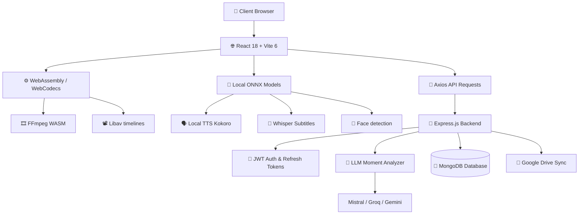

<!-- ===================================================== -->
<!--                  KATITOR README                        -->
<!-- ===================================================== -->

<div align="center">


### **The Browser-First AI Copilot for Video Content Creation**

<p align="center">


</p>

<p align="center">


</p>

</div>

---

# 📚 Quick Checkpoints & Navigation

* 🚀 [Project Overview](#-about-katitor)
* 💡 [Why Katitor?](#-why-katitor)
* ⚙️ [Feature Deep Dive (Each & Every Feature)](#-feature-deep-dive)
  * [🔐 Authentication & Sessions](#1-authentication--session-persistence)
  * [🗝️ API Credentials Panel](#2-api-credentials-setup-gate)
  * [📈 Projects Dashboard](#3-projects-dashboard)
  * [🧠 AI Moment Detection & Scoring](#4-ai-moment-detection--scoring)
  * [📝 Local Whisper Transcription](#5-in-browser-whisper-transcription)
  * [🗣️ Local Kokoro Text-To-Speech](#6-local-onnx-text-to-speech-tts)
  * [📐 Face Detection & Portrait Crop](#7-smart-916-face-tracking--cropping)
  * [🎞️ Multi-Track Video Timeline](#8-multi-track-precision-editor)
  * [📂 Google Drive Backup Sync](#9-google-drive-storage-sync)
  * [💾 Project Autosave & State](#10-project-autosave--states)
  * [📦 WebAssembly Video Renderer](#11-in-browser-wasm-ffmpeg-renderer)
* 🏗 [System Architecture](#-system-architecture)
* ⚡ [Technology Stack](#-technology-stack)
* 📂 [Project Structure Git Tree](#-project-structure)
* 🛣 [Client-Side View Routes](#-client-side-view-routes)
* 📡 [Backend REST API Endpoints](#-backend-rest-api-endpoints)
* 🛠️ [Getting Started (Local Installation)](#-getting-started)
* 🔑 [Environment Variables Guide](#-environment-variables)
* 🐳 [Docker Deployment Setup](#-docker-setup)
* 🔮 [Future Scope & Development Roadmap](#-future-scope--roadmap)
* 🤝 [Developers & Creators](#-developers)

---

# ✨ About Katitor

**Katitor** is a browser-first, high-performance AI video content creation and automation platform designed to turn long-form video files and livestreams into viral 9:16 Shorts and Clips. 

By leveraging browser-level **WebAssembly (WASM) and ONNX runtime environments**, Katitor performs complex operations—such as text-to-speech, transcription processing, smart face tracking, and multi-track rendering—directly inside the client's web browser, minimizing backend queue latencies and reducing server hosting overheads.

---

# 🌟 Why Katitor?

Instead of relying on heavy cloud compute setups that charge high subscription rates, Katitor shifts the heavy lifting of video processing and model inference directly onto the client side. This translates to absolute data privacy, instantaneous operations, and 0 backend processing charges for timeline rendering.

---

# ⚙️ Feature Deep Dive

Here is the exhaustive detailed breakdown of every single system feature built into Katitor:

### 1. Authentication & Session Persistence
* **Credential Login/Signup**: standard email/password authentication using salted bcrypt hashing on the backend.
* **Stateless double-token flows**: Issues a short-lived memory-based JWT access token for API requests and storing a secure, HTTP-only refresh token in the browser cookies.
* **Auto-refresh Interceptor**: An Axios interceptor automatically catches `401 Unauthorized` responses and silently calls `/api/auth/refresh` to fetch a new access token when a user returns or reloads the tab, keeping sessions persistent.
* **Google OAuth 2.0**: Fast registration and login using verified Google identity accounts.

### 2. API Credentials Setup Gate
* **Provider Keys Gate**: A setup screen verifying users have their respective API keys configured before entering the studio.
* **Broad LLM Provider support**: Input panel for Groq, Mistral, OpenAI, Deepgram, OpenRouter, Anthropic Claude, DeepSeek, and Google Gemini keys.
* **API Key Encryption**: Keys are encrypted at rest on the database matching the user account and verified before LLM-based queries.

### 3. Projects Dashboard
* **Workspace Overview**: A card grid listing all saved projects with timestamps, title cards, and statuses.
* **New Project Wizard**: Setup panel to import YouTube links, local MP4 files, or stream inputs.
* **Interactive Project Actions**: Instantly delete, load, duplicate, or preview project details from the core dashboard.

### 4. AI Moment Detection & Scoring
* **LLM-Based Video Mining**: Submits transcripts and visual cues to backend language models (Mistral/Groq) to locate key spikes in audience retention.
* **Clip Candidate Scoring**: Generates scored moment segments featuring confidence ratings, timestamps, titles, descriptions, and virality potential ratings.
* **Moment Refinement Prompt**: Users can feed custom prompt criteria to re-identify and score moments based on specific hooks.

### 5. In-Browser Whisper Transcription
* **Local Whisper Model Execution**: Performs offline speech-to-text directly in the client using `@huggingface/transformers` running on ONNX Web Runtime.
* **Automatic SRT/VTT Generation**: Generates synchronized timestamped subtitle arrays, formatting captions down to the millisecond.

### 6. Local ONNX Text-To-Speech (TTS)
* **In-Browser Audio Generation**: Runs the Kokoro speech synthesis model locally in the browser to turn typed text into high-fidelity natural speech.
* **Multi-Language Support**: Supports generating voice tracks in over 14 languages with zero backend latency or token pricing.

### 7. Smart 9:16 Face-Tracking & Cropping
* **Automatic Character Tracking**: MediaPipe facial landmarking algorithms scan video frames to locate faces and tracking movements.
* **Optical Flow Adjustments**: Dynamically generates translation coordinates on the timeline to keep characters centered when landscape videos are cropped to vertical 9:16 frames.

### 8. Multi-Track Precision Editor
* **Multi-Track Timelines**: Layers backing video streams, overlays, local speech tracks, and sound effect layers.
* **Timeline Controls**: Drag to split, slice, resize, move, delete, or layer elements with sub-frame accuracy.
* **Dynamic Subtitle Overlays**: Customize caption typography, font weight, animations, active word highlight styling, and alignment.

### 9. Google Drive Storage Sync
* **Automated Sync**: Integrates with Google Drive to back up projects, transcripts, audio segments, and rendered videos.
* **Asset Proxy**: Uses backend proxy routers to stream assets directly from Drive folders to the browser timeline.

### 10. Project Autosave & States
* **Periodic Autosave**: Editor layout configurations (tracks, durations, text blocks, volume levels) are regularly pushed to `/api/projects/:projectId/state` to prevent work loss.
* **State Recovery**: Restores project configurations to the exact millisecond upon workspace reloading.

### 11. In-Browser WASM FFmpeg Renderer
* **Local Transcoding**: Compiles the final video on the user's local browser using WebAssembly FFmpeg.
* **WASM Timeline Encoding**: Utilizes custom WebCodecs to multiplex multi-track files locally, bypassing server rendering queues.

---

# 🏗 System Architecture



---

# ⚡ Technology Stack

### 🎨 Frontend (Client)

| Technology | Purpose |
|------------|----------|
| React 18 | Client UI Library |
| Vite 6 | Development Server & Production Bundler |
| Tailwind CSS | Premium Responsive Styling |
| Framer Motion | Smooth Micro-animations & Transitions |
| Swiper | Slider/Carousel Components |
| @ffmpeg/ffmpeg | In-browser WebAssembly Video Rendering |
| @libav.js/variant-webcodecs | Precision Sub-frame Timeline Compatibility |
| @huggingface/transformers | Running Whisper and local AI models in-browser |
| @diffusionstudio/vits-web | Offline Speech Synthesis |
| @mediapipe/tasks-vision | Face Tracking & Landmarking |

### 🚀 Backend (Server)

| Technology | Purpose |
|------------|----------|
| Node.js 20+ | Execution Runtime |
| Express.js 5 | REST API Layer |
| Mongoose 8 | MongoDB ODM |
| Pino | Structured High-speed Logger |
| JSONWebToken | Stateless Auth & Refresh Token Cycles |
| Bcrypt.js | Password Hashing |
| Google APIs | Drive Storage Integration |

---

# 📂 Project Structure

```text
Katitor/
├── client/                              # React Frontend Codebase
│   ├── src/
│   │   ├── app/
│   │   │   ├── layouts/                 # Main App Layouts
│   │   │   ├── router/                  # React Router Configs
│   │   │   └── providers/               # App Context Providers
│   │   ├── features/
│   │   │   ├── landing/                 # Landing Page Components
│   │   │   │   └── duevora/
│   │   │   │       ├── components/      # Hero, Event, WhoWeAre, Footer, Slider, Sticky
│   │   │   │       ├── constants/
│   │   │   │       └── DuevoraLanding.tsx
│   │   │   └── pages/                   # Login, Signup, Landing wrapper
│   │   ├── components/                  # Common UI components (Setup Gate, Editor)
│   │   │   └── ApiKeySetupGate.jsx
│   │   ├── lib/
│   │   │   └── api.js                   # Axios client & 401 Interceptors
│   │   ├── landing.css                  # Custom keyframe animations
│   │   ├── main.jsx                     # Entry Point
│   │   └── App.jsx                      # App component containing the Editor
│   ├── public/                          # Media Assets & Videos
│   └── package.json
│
├── server/                              # Node/Express Backend Codebase
│   ├── src/
│   │   ├── modules/
│   │   │   ├── public/
│   │   │   │   └── auth/                # Sign Up, Log In, Google OAuth
│   │   │   └── private/
│   │   │       ├── projects/            # Project storage and editor states
│   │   │       ├── candidates/          # LLM Moment candidates
│   │   │       ├── environment/         # API Key manager
│   │   │       └── ollama/              # Local LLM tags
│   │   ├── shared/
│   │   │   ├── config/                  # Database, Env, Pino Logger config
│   │   │   ├── middlewares/             # JWT auth & error interceptors
│   │   │   ├── models/                  # User, Project, Session schemas
│   │   │   └── utils/                   # OAuth, Hashing, Token generation
│   │   └── app.ts                       # Express App setup
│   ├── server.ts                        # Main server startup script
│   └── package.json
│
├── docker-compose.yml                   # Local container orchestration
└── Dockerfile                           # Deployment configuration
```

---

# 🛣 Client-Side View Routes

| Route | View Component | Access | Description |
|-------|----------------|--------|-------------|
| `/` | `LandingPage` | Public | Premium homepage showcasing Katitor value props |
| `/login` | `LoginPage` | Public | Login credentials panel with `login.mp4` preview |
| `/signup` | `LoginPage` | Public | Register credentials panel with `signup.mp4` preview |
| `/dashboard` | `DashboardPage` | Private | Project library lists, project creation |
| `/editor` | `DashboardPage` | Private | Blank timeline editor viewport |
| `/editor/:projectId` | `DashboardPage` | Private | Active timeline editor loaded with project state |

---

# 📡 Backend REST API Endpoints

### 🔐 Authentication Module (`/api/auth`)
* `POST /register`: Registers new credentials.
* `POST /login`: Log in to generate tokens.
* `POST /refresh`: Refresh access token via HTTP-Only cookie.
* `POST /logout`: Invalidates session and clears cookies.
* `GET /me`: Returns profile of the logged-in user.
* `GET /google`: Initiates Google OAuth sequence.
* `GET /google/callback`: Finalizes OAuth parameters.

### 🎬 Projects Module (`/api/projects`)
* `GET /`: Retrieve all projects under the logged-in account.
* `POST /`: Initialize a new project, parse inputs, trigger initial moment finding.
* `GET /:projectId`: Retrieve saved timeline state, transcript tracks, and properties.
* `PUT /:projectId/state`: Autosave current editor config (timeline layout, active overlays).
* `DELETE /:projectId`: Delete a project and cleanup drive files.
* `GET /:projectId/drive-files`: Retrieve drive files list.
* `GET /:projectId/drive-files/:fileId/content`: Proxy fetch files from Google Drive.
* `POST /:projectId/export`: Compile project assets for export.

### 🤖 Candidates Module (`/api/candidates`)
* `GET /:projectId`: List identified viral moments and engagement scores.
* `POST /:projectId/regenerate`: Instruct the AI to re-scan transcripts with custom prompts.

### ⚙️ Configuration Module (`/api/environment`)
* `GET /keys`: List user's active API keys (masked).
* `POST /keys`: Save API credentials for Groq, Mistral, OpenAI, Gemini, etc.

### 🐳 Local Model Module (`/api/ollama`)
* `GET /tags`: Returns list of available local Ollama models.

---

# 🚀 Getting Started

Follow these instructions to set up Katitor in your local development environment:

### Prerequisites
- **Node.js** v20 or higher.
- **MongoDB** instance (local or Atlas cluster).
- **npm** or **yarn** package manager.

### 1. Set Up the Server
1. Navigate to the server folder:
   ```bash
   cd server
   ```
2. Install server dependencies:
   ```bash
   npm install
   ```
3. Copy the environment variables template and configure it:
   ```bash
   cp .env.example .env
   ```
4. Start the server in development mode:
   ```bash
   npm run dev
   ```

### 2. Set Up the Client
1. Open a new terminal window and navigate to the client folder:
   ```bash
   cd client
   ```
2. Install client dependencies:
   ```bash
   npm install
   ```
3. Start the client dev server:
   ```bash
   npm run dev
   ```
4. Open `http://localhost:5173` in your browser.

---

# 🔑 Environment Variables

The server relies on the following configurations in its `.env` file:

```env
PORT=5000
MONGO_URI=mongodb://localhost:27017/katitor
NODE_ENV=development

# JWT Secret tokens
ACCESS_TOKEN_SECRET=your_short_term_jwt_access_secret_key
REFRESH_TOKEN_SECRET=your_long_term_jwt_refresh_secret_key

# Google OAuth Credentials
GOOGLE_CLIENT_ID=your_google_client_id
GOOGLE_CLIENT_SECRET=your_google_client_secret
GOOGLE_REDIRECT_URI=http://localhost:5000/api/auth/google/callback

# Google Drive Sync Storage
GDRIVE_SERVICE_ACCOUNT_KEY=your_google_service_account_json_content
GDRIVE_CENTRAL_FOLDER_ID=your_shared_gdrive_folder_id

# Mail SMTP Credentials (Optional)
SMTP_HOST=smtp.gmail.com
SMTP_PORT=587
SMTP_USER=your_gmail_id@gmail.com
SMTP_PASS=your_gmail_app_password
SEND_MAIL=false
```

---

# 🐳 Docker Setup

Katitor can be run locally in containers using Docker Compose.

1. Configure variables in `.env` files.
2. Build and run containers from the root workspace folder:
   ```bash
   docker-compose up --build
   ```
3. The client will be available at `http://localhost:5173` and the backend server at `http://localhost:5000`.

---

# 🔮 Future Scope & Roadmap

- **👥 Multi-user Real-time Collaboration**: Shared workspace boards where multiple users edit timelines concurrently.
- **⚡ Serverless Render Rendering Queue**: Shift final heavy video compilation from browser WASM to serverless cloud workers to reduce client GPU strain on low-end devices.
- **🎨 AI Template Gallery**: Templates for auto-generating animations, overlays, and style presets based on TikTok/YouTube Trends.
- **📈 Viral Social Publishing**: Connect YouTube, TikTok, and Instagram accounts to post clips directly from the editor console.

---

# 🤝 Developers

Designed, built, and maintained with ❤️ by:
- **Bhavya Dhanwani** — Core Software Architect & Lead Developer & CEO
- **Gaurav Chhajer** — Creative UI/UX and Full Stack Engineer
